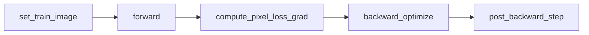
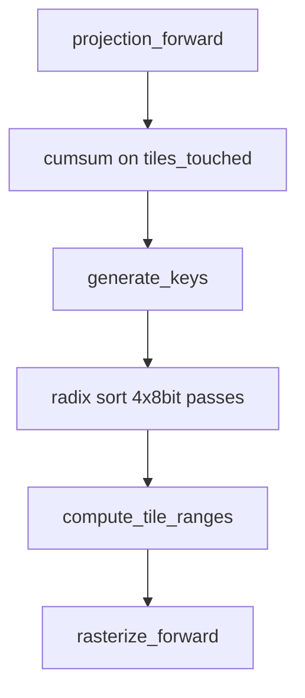
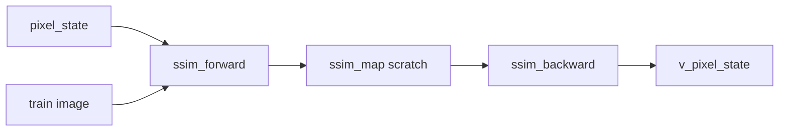
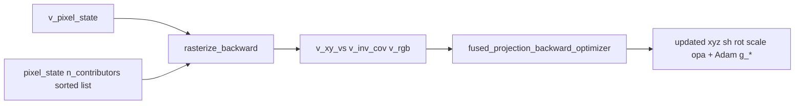
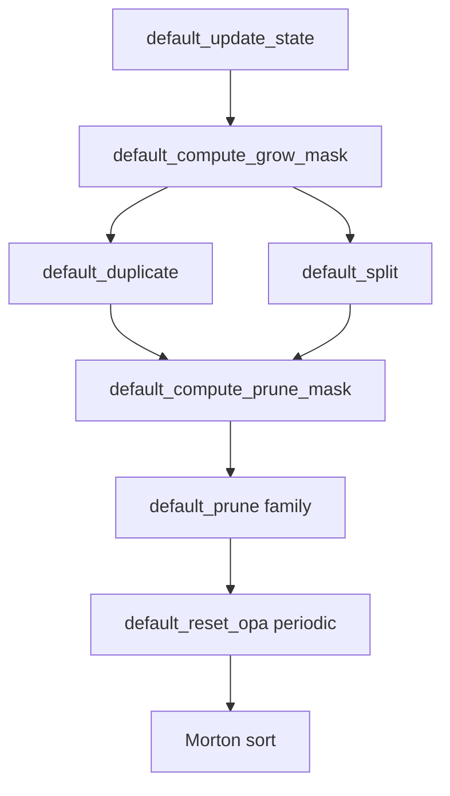
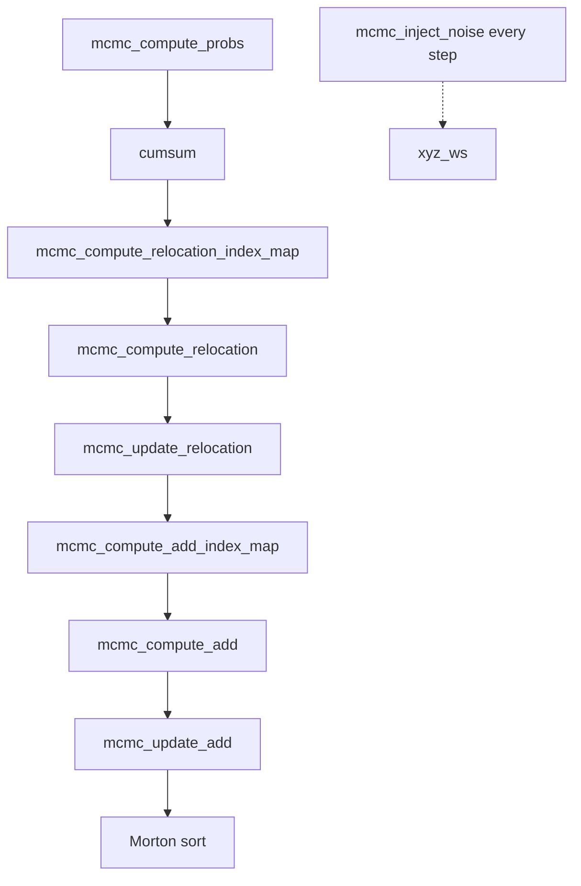
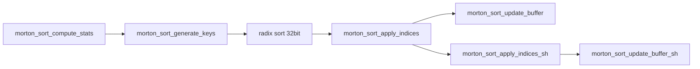

# VkSplat GPU Shader Pipeline

VkSplat trains 3D Gaussian Splatting (3DGS) entirely on the GPU. Slang and GLSL compute shaders are compiled offline to SPIR-V (`vksplat/shader/generated/*.spv`) and loaded at runtime. Python drives training through the `vksplat.VkSplat` binding; all dispatches go through C++ (`VulkanGSPipeline::executeCompute`).

**Class hierarchy:** `VulkanGSPipeline` → `VulkanGSRenderer` → `VulkanGSTrainer`

| Layer | File | Role |
|-------|------|------|
| Session/API | `vksplat/src/training_session.cpp`, `vksplat/src/python_bindings.cpp` | `train_step`, `forward`, per-stage debug entry points |
| Renderer | `vksplat/src/gs_renderer.cpp` | Projection, tile sort, rasterize |
| Trainer | `vksplat/src/gs_trainer.cpp` | SSIM loss, optimizer, densification, Morton reorder |
| Buffers | `vksplat/src/buffer.h` | `VulkanGSPipelineBuffers` layout |
| Shader sources | `vksplat/slang/*.slang`, `vksplat/shader/radix_sort/*.comp` | Authoritative kernel logic |

---

## Binding model

Every kernel is a Vulkan compute shader with:

- **Descriptor set 0:** sequential `VK_DESCRIPTOR_TYPE_STORAGE_BUFFER` bindings `0 .. N-1` (order matches the buffer vector passed to `executeCompute` in C++).
- **Push constants:** uniforms (camera, step, learning rates, image size, etc.). Max 192 bytes.
- **No textures** — all data lives in storage buffers.

Tile size is 16×16 (`TILE_WIDTH` / `TILE_HEIGHT` in `vksplat/slang/config.slang`).

---

## Training step overview

From `VkSplatTrainingSession::train_step` in `training_session.cpp`:



| Phase | C++ entry | Subgraphs |
|-------|-----------|-----------|
| `forward()` | `projection_forward` → `process_tiles` → `rasterize_forward` | A |
| `compute_pixel_loss_grad()` | `executeComputeSSIMGradient` | B |
| `backward_optimize()` | `executeRasterizeBackward` → `executeFusedProjectionBackwardOptimizerStep` | C |
| `post_backward_step()` | `executeDefaultPostBackward` or `executeMCMCPostBackward` | E or F (+ G) |

**Early exit:** after prefix-summing `tiles_touched`, if `num_indices == 0` the pipeline skips `generate_keys`, sort, rasterize, loss, and backward (see `process_tiles` and `compute_pixel_loss_grad`).

**Viewer / eval:** `render_train` and `render_val` call only `forward()` (Subgraph A).

---

## Global buffer map

All fields are in `VulkanGSPipelineBuffers` (`buffer.h`). `N` = `num_splats`; `M` = `num_indices` (total Gaussian–tile instances).

### Gaussian parameters (persistent across steps)

| Buffer | Shape | Description |
|--------|-------|-------------|
| `xyz_ws` | (N, 3) | World-space positions |
| `sh_coeffs` | (N, 16, 3) stored as 12×float4 blocks | Spherical harmonic coefficients |
| `rotations` | (N, 4) | Quaternions |
| `scales_opacs` | (N, 4) | Scale xyz + opacity |

### Projection intermediates (refreshed each forward)

| Buffer | Shape | Description |
|--------|-------|-------------|
| `tiles_touched` | (N,) | Tile overlap count per splat |
| `rect_tile_space` | (N,) | Tile bounding rect (int64) |
| `radii` | (N,) | Screen radius (densification stats) |
| `xy_vs` | (N, 2) | View-space xy |
| `depths` | (N,) | View-space depth |
| `inv_cov_vs_opacity` | (N, 4) | Inverse 2D covariance + opacity |
| `rgb` | (N, 3) | View-dependent color |

### Tile sort (ping-pong)

| Buffer | Shape | Description |
|--------|-------|-------------|
| `index_buffer_offset` | (N,) | Exclusive prefix sum of `tiles_touched` |
| `sorting_keys_1`, `sorting_keys_2` | (M,) | Sort keys `[no_shrink]` |
| `sorting_gauss_idx_1`, `sorting_gauss_idx_2` | (M,) | Splat index per instance `[no_shrink]` |
| `is_unsorted_1` | bool | Ping-pong selector |
| `tile_ranges` | (num_tiles+1,) | Start index per tile in sorted instance list |

**Ping-pong accessors** (critical for radix sort):

```cpp
unsorted_keys()   // input keys for current pass
sorted_keys()     // output keys for current pass
unsorted_gauss_idx()
sorted_gauss_idx()
```

After each radix digit pass, `is_unsorted_1` toggles. Two pipeline instances (`pipeline_sorting_1` / `_2`) avoid in-place hazards.

### Image state

| Buffer | Shape | Description |
|--------|-------|-------------|
| `pixel_state` | (H, W, 4) | Rendered RGBA + transmittance |
| `n_contributors` | (H, W) | Splats contributing per pixel |
| `v_pixel_state` | (H, W, 4) | Pixel loss gradient |
| `ref_image` | (H, W, 4) | Reference image scratch (dataset swap) |

### Gradients and Adam state

| Buffer | Shape | Description |
|--------|-------|-------------|
| `v_xy_vs` | (N, 2) | Splat gradient: screen position |
| `v_inv_cov_vs_opacity` | (N, 4) | Splat gradient: inv cov + opacity |
| `v_rgb` | (N, 3) | Splat gradient: color |
| `g_xyz_ws` | (N, 2, 3) | Adam moments for means |
| `g_sh_coeffs_1`, `g_sh_coeffs_2` | (N, 16, 3) | Adam moments for SH |
| `g_rotations` | (N, 2, 4) | Adam moments for rotation |
| `g_scales_opacs` | (N, 2, 4) | Adam moments for scale/opacity |

### Strategy state

| Buffer | Role |
|--------|------|
| `default_grad`, `default_radii` | Running 2D gradient stats (Default ADC) |
| `default_dupli_mask`, `default_split_mask`, `default_keep_mask` | Grow/prune masks |
| `mcmc_sample_probs`, `mcmc_sample_probs_cumsum` | Opacity-based sampling weights |
| `mcmc_index_map`, `mcmc_n_idx_buffer` | Relocation/add index maps |

### Scratch

| Buffer | Typical use |
|--------|-------------|
| `_temp_gauss_attr` | Morton gather/scatter, SSIM map (`ssim_map`), prune compaction |
| `_temp_indices` | Compact index lists (`where`, prune PSA) |
| `_temp_sum` | `sum` reduction, Morton bounding stats (6 floats) |
| `_temp_cumsum` | Prefix sum for `where` |
| `_cumsum_blockSums`, `_cumsum_blockSums2` | Multi-level cumsum |
| `_sorting_histogram`, `_sorting_histogram_cumsum` | Radix sort histograms |

---

## Subgraph A — Forward render

Projects Gaussians to screen space, builds a sorted per-tile instance list, and alpha-composites the image.



**C++ entry:** `VkSplat::forward()` → `projection_forward()` + `process_tiles()` + `rasterize_forward()`.

### projection_forward

| | |
|---|---|
| **SPIR-V** | `projection_forward` |
| **Source** | `vertex_shader.slang` |
| **C++** | `VulkanGSRenderer::executeProjectionForward` |
| **Push constants** | `VulkanGSRendererUniforms` |

| Bind | Buffer | R/W | Shape |
|------|--------|-----|-------|
| 0 | `xyz_ws` | R | (N, 3) |
| 1 | `sh_coeffs` | R | (N, 16, 3) |
| 2 | `rotations` | R | (N, 4) |
| 3 | `scales_opacs` | R | (N, 4) |
| 4 | `tiles_touched` | W | (N,) |
| 5 | `rect_tile_space` | W | (N,) |
| 6 | `radii` | W | (N,) |
| 7 | `xy_vs` | W | (N, 2) |
| 8 | `depths` | W | (N,) |
| 9 | `inv_cov_vs_opacity` | W | (N, 4) |
| 10 | `rgb` | W | (N, 3) |

Projects each splat: SH evaluation, 2D covariance, tile overlap count, screen attributes.

### cumsum (index buffer offset)

| | |
|---|---|
| **SPIR-V** | `cumsum_single_pass`, `cumsum_block_scan`, `cumsum_scan_block_sums`, `cumsum_add_block_offsets` |
| **Source** | `cumsum.slang` |
| **C++** | `VulkanGSRenderer::executeCumsum` via `executeCalculateIndexBufferOffset` |
| **Push constants** | `{ numElements }` |

| Variant | Buffers | When |
|---------|---------|------|
| `single_pass` (2) | input, output | N ≤ 1024 |
| `block_scan` + `scan_block_sums` + `add_block_offsets` (3 each) | input, output, `_cumsum_blockSums` [+ `_cumsum_blockSums2`] | larger N |

Input: `tiles_touched`. Output: `index_buffer_offset`. Last element → `num_indices` (total instances).

### generate_keys

| | |
|---|---|
| **SPIR-V** | `generate_keys` |
| **Source** | `tile_shader.slang` (`ENTRY=1`) |
| **C++** | `VulkanGSRenderer::executeGenerateKeys` |

| Bind | Buffer | R/W |
|------|--------|-----|
| 0 | `xy_vs` | R |
| 1 | `inv_cov_vs_opacity` | R |
| 2 | `depths` | R |
| 3 | `rect_tile_space` | R |
| 4 | `index_buffer_offset` | R |
| 5 | `unsorted_keys()` | W |
| 6 | `unsorted_gauss_idx()` | W |

Emits `(tile_id << depth_bits) | depth_bits` sort keys and splat indices for each Gaussian–tile intersection.

### radix sort

| | |
|---|---|
| **SPIR-V** | `radix_sort/upsweep`, `radix_sort/spine`, `radix_sort/downsweep` |
| **Source** | `vksplat/shader/radix_sort/*.comp` (GLSL) |
| **C++** | `VulkanGSRenderer::executeSort` |
| **Push constants** | `{ pass, elementCount }` per 8-bit digit |

Per digit pass (typically 4 passes for tile+depth keys):

| Stage | Bindings |
|-------|----------|
| **upsweep** (3) | `unsorted_keys`, `_sorting_histogram`, `_sorting_histogram_cumsum` |
| **spine** (2) | `_sorting_histogram`, `_sorting_histogram_cumsum` |
| **downsweep** (6) | histogram, histogram_cumsum, unsorted keys, unsorted indices → sorted keys, sorted indices |

Ping-pongs `sorting_keys_*` and `sorting_gauss_idx_*` via `is_unsorted_1`.

### compute_tile_ranges

| | |
|---|---|
| **SPIR-V** | `compute_tile_ranges` |
| **Source** | `tile_shader.slang` (`ENTRY=2`) |
| **C++** | `VulkanGSRenderer::executeComputeTileRanges` |

| Bind | Buffer | R/W |
|------|--------|-----|
| 0 | `sorted_keys()` | R |
| 1 | `tile_ranges` | W |

Builds per-tile `[start, end)` indices into the sorted instance list. `active_sh` in uniforms is aliased to `num_indices`.

### rasterize_forward

| | |
|---|---|
| **SPIR-V** | `rasterize_forward` |
| **Source** | `alphablend_shader.slang` |
| **C++** | `VulkanGSRenderer::executeRasterizeForward` |
| **Dispatch** | one 16×16 thread group per image tile |

| Bind | Buffer | R/W |
|------|--------|-----|
| 0 | `sorted_gauss_idx()` | R |
| 1 | `tile_ranges` | R |
| 2 | `xy_vs` | R |
| 3 | `inv_cov_vs_opacity` | R |
| 4 | `rgb` | R |
| 5 | `pixel_state` | W |
| 6 | `n_contributors` | W |

Alpha-composites splats front-to-back per tile; writes accumulated color/transmittance and contributor count.

---

## Subgraph B — Loss (SSIM + L1)

Compares the rendered image to the training reference and produces per-pixel loss gradients for backward.



**C++ entry:** `VulkanGSTrainer::executeComputeSSIMGradient`

### ssim_forward

| | |
|---|---|
| **SPIR-V** | `ssim_forward` |
| **Source** | `ssim.slang` |
| **Push constants** | `{ imageWidth, imageHeight, gradWeightL1, gradWeightSSIM }` |

| Bind | Buffer | R/W |
|------|--------|-----|
| 0 | `pixel_state` | R |
| 1 | train image (dataset buffer) | R |
| 2 | `ssim_map` (`_temp_gauss_attr`) | W |

Writes per-pixel SSIM map (SSIM value + partial derivatives). The SSIM map buffer reuses `_temp_gauss_attr` to save VRAM.

### ssim_backward

| Bind | Buffer | R/W |
|------|--------|-----|
| 0 | `pixel_state` | R |
| 1 | train image | R |
| 2 | `ssim_map` | R |
| 3 | `v_pixel_state` | W |

Combines L1 and SSIM gradients into `v_pixel_state` for rasterize backward.

---

## Subgraph C — Backward + optimizer

Backpropagates through alpha blending, then through projection with an in-place Adam update.



**C++ entry:** `VkSplat::backward_optimize()` → `executeRasterizeBackward` + `executeFusedProjectionBackwardOptimizerStep`

### rasterize_backward

| | |
|---|---|
| **SPIR-V** | `rasterize_backward_0` … `rasterize_backward_4` |
| **Source** | `alphablend_shader.slang` + `alphablend_shader_bwd_*.slang` |
| **C++** | `VulkanGSRenderer::executeRasterizeBackward` |

Five variants: per-pixel (`_0`), per-splat (`_1`), tensor (`_2`–`_4`). A Thompson-sampling scheduler picks the fastest variant per GPU vendor. All share the same 11-buffer layout:

| Bind | Buffer | R/W |
|------|--------|-----|
| 0 | `sorted_gauss_idx()` | R |
| 1 | `tile_ranges` | R |
| 2 | `xy_vs` | R |
| 3 | `inv_cov_vs_opacity` | R |
| 4 | `rgb` | R |
| 5 | `pixel_state` | R |
| 6 | `n_contributors` | R |
| 7 | `v_pixel_state` | R |
| 8 | `v_xy_vs` | W (atomics) |
| 9 | `v_inv_cov_vs_opacity` | W (atomics) |
| 10 | `v_rgb` | W (atomics) |

### fused_projection_backward_optimizer

| | |
|---|---|
| **SPIR-V** | `fused_projection_backward_optimizer` |
| **Source** | `fused_projection_backward_optimizer.slang` |
| **C++** | `VulkanGSTrainer::executeFusedProjectionBackwardOptimizerStep` |
| **Push constants** | `VulkanGSFusedProjectionBackwardOptimizerUniforms` (step, LRs, camera) |

| Bind | Buffer | R/W |
|------|--------|-----|
| 0 | `xyz_ws` | RW |
| 1 | `sh_coeffs` | RW |
| 2 | `rotations` | RW |
| 3 | `scales_opacs` | RW |
| 4 | `tiles_touched` | R |
| 5 | `v_xy_vs` | R |
| 6 | `v_inv_cov_vs_opacity` | R |
| 7 | `v_rgb` | R |
| 8 | `g_xyz_ws` | RW |
| 9 | `g_sh_coeffs_1` | RW |
| 10 | `g_sh_coeffs_2` | RW |
| 11 | `g_rotations` | RW |
| 12 | `g_scales_opacs` | RW |

Autodiffs through `project_gaussian_to_camera`, then applies Adam on all Gaussian parameters in one fused kernel. Splats with `tiles_touched == 0` are skipped.

---

## Subgraph D — Utility kernels

Shared building blocks invoked inside other subgraphs.

| Shader | Bindings | Role | Used by |
|--------|----------|------|---------|
| `cumsum_*` | input (0), output (1), block sums (2–3) | GPU prefix sum | tile indexing, `where`, MCMC, prune |
| `sum` | mask (0) → `_temp_sum` (1) | Parallel reduction count | grow/prune sizing |
| `where` | mask (0), PSA (1) → indices (2) | Compact true indices | duplicate/split source lists |

### sum

| Bind | Buffer | R/W |
|------|--------|-----|
| 0 | input mask | R |
| 1 | `_temp_sum` | W |

### where

| Bind | Buffer | R/W |
|------|--------|-----|
| 0 | input mask | R |
| 1 | `_temp_cumsum` (from cumsum on mask) | R |
| 2 | output indices | W |

---

## Subgraph E — Default densification (ADC)

Original adaptive densification: accumulate gradient stats, duplicate/split, prune, periodic opacity reset, then Morton reorder.



**C++ entry:** `VulkanGSTrainer::executeDefaultPostBackward` (when `step < refine_stop_iter`)

**Push constants:** `VulkanGSDefaultStrategyUniforms`

Grow/split runs on `refine_every` intervals after `refine_start_iter`. Prune compaction uses `cumsum` on `default_keep_mask` → `_temp_indices`.

### default_update_state

| Bind | Buffer | R/W |
|------|--------|-----|
| 0 | `v_xy_vs` | R |
| 1 | `radii` | R |
| 2 | `default_grad` | W |
| 3 | `default_radii` | W |

### default_compute_grow_mask

| Bind | Buffer | R/W |
|------|--------|-----|
| 0 | `default_grad` | R |
| 1 | `default_radii` | R |
| 2 | `scales_opacs` | R |
| 3 | `default_dupli_mask` | W |
| 4 | `default_split_mask` | W |

### default_duplicate / default_split

12 bindings each:

| Bind | Buffer |
|------|--------|
| 0 | `_temp_indices` (from `where`) |
| 1–4 | `xyz_ws`, `sh_coeffs`, `rotations`, `scales_opacs` |
| 5–9 | `g_xyz_ws`, `g_sh_coeffs_1`, `g_sh_coeffs_2`, `g_rotations`, `g_scales_opacs` |
| 10–11 | `default_grad`, `default_radii` |

### default_compute_prune_mask

| Bind | Buffer | R/W |
|------|--------|-----|
| 0 | `scales_opacs` | R |
| 1 | `default_radii` | R |
| 2 | `default_keep_mask` | W |

### default_prune / default_prune_mean / default_prune_sh

4 bindings each:

| Bind | Buffer | R/W |
|------|--------|-----|
| 0 | `default_keep_mask` | R |
| 1 | `_temp_indices` (cumsum PSA) | R |
| 2 | source buffer | R |
| 3 | `_temp_gauss_attr` | W |

Applied to all Gaussian and optimizer buffers; SH uses `prune_sh`, means use `prune_mean`.

### default_reset_opa

| Bind | Buffer | R/W |
|------|--------|-----|
| 0 | `scales_opacs` | RW |
| 1 | `g_scales_opacs` | RW |

Runs every `reset_every` steps. Ends with Morton sort (Subgraph G) on `refine_every` steps.

---

## Subgraph F — MCMC densification

Opacity-driven relocation and growth up to `cap_max`, plus per-step position noise.



**C++ entry:** `VulkanGSTrainer::executeMCMCPostBackward`

Relocation/add runs on `refine_every` after `refine_start_iter`. `mcmc_inject_noise` runs **every step**.

### mcmc_compute_probs

| Bind | Buffer | R/W |
|------|--------|-----|
| 0 | `scales_opacs` | R |
| 1 | `mcmc_sample_probs` | W |

### mcmc_compute_relocation_index_map

| Bind | Buffer | R/W |
|------|--------|-----|
| 0 | `mcmc_sample_probs` | R |
| 1 | `mcmc_sample_probs_cumsum` | R |
| 2 | `mcmc_index_map` | W |
| 3 | `mcmc_n_idx_buffer` | W |

### mcmc_compute_relocation

| Bind | Buffer |
|------|--------|
| 0 | `mcmc_n_idx_buffer` |
| 1 | `scales_opacs` |
| 2–6 | `g_xyz_ws`, `g_sh_coeffs_1`, `g_sh_coeffs_2`, `g_rotations`, `g_scales_opacs` |

### mcmc_update_relocation

| Bind | Buffer |
|------|--------|
| 0 | `mcmc_index_map` |
| 1–4 | `xyz_ws`, `sh_coeffs`, `rotations`, `scales_opacs` |
| 5–9 | `g_xyz_ws`, `g_sh_coeffs_1`, `g_sh_coeffs_2`, `g_rotations`, `g_scales_opacs` |

### mcmc_compute_add_index_map

| Bind | Buffer | R/W |
|------|--------|-----|
| 0 | `mcmc_sample_probs_cumsum` | R |
| 1 | `mcmc_index_map` | W |
| 2 | `mcmc_n_idx_buffer` | W |

### mcmc_compute_add

| Bind | Buffer | R/W |
|------|--------|-----|
| 0 | `mcmc_n_idx_buffer` | R |
| 1 | `scales_opacs` | RW |

### mcmc_update_add

| Bind | Buffer |
|------|--------|
| 0 | `mcmc_index_map` |
| 1 | `xyz_ws` |
| 2 | `sh_coeffs` |
| 3 | `rotations` |
| 4 | `scales_opacs` |
| 5 | `g_xyz_ws` |
| 6 | `g_sh_coeffs_1` |
| 7 | `g_sh_coeffs_2` |
| 8 | `g_rotations` |
| 9 | `g_scales_opacs` |

### mcmc_inject_noise

| Bind | Buffer | R/W |
|------|--------|-----|
| 0 | `radii` | R |
| 1 | `rotations` | R |
| 2 | `xyz_ws` | RW |
| 3 | `scales_opacs` | RW |

---

## Subgraph G — Morton spatial reorder

Reorders all splat arrays by 3D Morton code of normalized positions for memory locality. Called after refine in both strategies (`executeMortonSorting`).



### morton_sort_compute_stats

| Bind | Buffer | R/W |
|------|--------|-----|
| 0 | `xyz_ws` | R |
| 1 | `_temp_sum` (6 floats: Σx, Σx²) | W |

### morton_sort_generate_keys

| Bind | Buffer | R/W |
|------|--------|-----|
| 0 | `xyz_ws` | R |
| 1 | `_temp_sum` | R |
| 2 | `unsorted_keys()` | W |
| 3 | `unsorted_gauss_idx()` | W |

Radix sort runs with `num_bits=32` (`executeSort(..., 32)`).

### morton_sort_apply_indices / apply_indices_sh

| Bind | Buffer | R/W |
|------|--------|-----|
| 0 | `sorted_gauss_idx()` | R |
| 1 | source buffer | R |
| 2 | `_temp_gauss_attr` | W |

### morton_sort_update_buffer / update_buffer_sh

| Bind | Buffer | R/W |
|------|--------|-----|
| 0 | `_temp_gauss_attr` | R |
| 1 | destination buffer | W |

Applied to all Gaussian params, optimizer state, and `default_grad` / `default_radii`.

---

## Cross-stage data flow

| Producer | Consumer | Buffer / data |
|----------|----------|---------------|
| `projection_forward` | cumsum | `tiles_touched` |
| cumsum | `generate_keys` | `index_buffer_offset` → `num_indices` |
| `projection_forward` | `generate_keys` | `xy_vs`, `depths`, `rect_tile_space`, `inv_cov_vs_opacity` |
| `generate_keys` | radix sort | `unsorted_keys`, `unsorted_gauss_idx` |
| radix sort | `compute_tile_ranges` | `sorted_keys` |
| radix sort | rasterize fwd/bwd | `sorted_gauss_idx` |
| `compute_tile_ranges` | rasterize fwd/bwd | `tile_ranges` |
| `projection_forward` | rasterize fwd/bwd | `xy_vs`, `inv_cov_vs_opacity`, `rgb` |
| `rasterize_forward` | SSIM | `pixel_state` |
| train image | SSIM | reference pixels |
| SSIM backward | rasterize backward | `v_pixel_state` |
| `rasterize_forward` | rasterize backward | `pixel_state`, `n_contributors` |
| rasterize backward | fused optimizer | `v_xy_vs`, `v_inv_cov_vs_opacity`, `v_rgb` |
| fused optimizer | next forward | updated `xyz_ws`, `sh_coeffs`, `rotations`, `scales_opacs` |
| `projection_forward` | default/MCMC | `radii`, `v_xy_vs` |
| densification | next forward | resized/reordered Gaussian buffers |
| Morton sort | next forward | spatially reordered buffers |

---

## Shader index

Alphabetical SPIR-V name → source → C++ dispatcher → subgraph.

| SPIR-V | Source | C++ function | Subgraph |
|--------|--------|--------------|----------|
| `compute_tile_ranges` | `tile_shader.slang` | `executeComputeTileRanges` | A |
| `cumsum_add_block_offsets` | `cumsum.slang` | `executeCumsum` | D |
| `cumsum_block_scan` | `cumsum.slang` | `executeCumsum` | D |
| `cumsum_scan_block_sums` | `cumsum.slang` | `executeCumsum` | D |
| `cumsum_single_pass` | `cumsum.slang` | `executeCumsum` | D |
| `default_compute_grow_mask` | `default.slang` | `executeDefaultPostBackward` | E |
| `default_compute_prune_mask` | `default.slang` | `executeDefaultPostBackward` | E |
| `default_duplicate` | `default.slang` | `executeDefaultPostBackward` | E |
| `default_prune` | `default.slang` | `executeDefaultPostBackward` | E |
| `default_prune_mean` | `default.slang` | `executeDefaultPostBackward` | E |
| `default_prune_sh` | `default.slang` | `executeDefaultPostBackward` | E |
| `default_reset_opa` | `default.slang` | `executeDefaultPostBackward` | E |
| `default_split` | `default.slang` | `executeDefaultPostBackward` | E |
| `default_update_state` | `default.slang` | `executeDefaultPostBackward` | E |
| `fused_projection_backward_optimizer` | `fused_projection_backward_optimizer.slang` | `executeFusedProjectionBackwardOptimizerStep` | C |
| `generate_keys` | `tile_shader.slang` | `executeGenerateKeys` | A |
| `mcmc_compute_add` | `mcmc.slang` | `executeMCMCPostBackward` | F |
| `mcmc_compute_add_index_map` | `mcmc.slang` | `executeMCMCPostBackward` | F |
| `mcmc_compute_probs` | `mcmc.slang` | `executeMCMCPostBackward` | F |
| `mcmc_compute_relocation` | `mcmc.slang` | `executeMCMCPostBackward` | F |
| `mcmc_compute_relocation_index_map` | `mcmc.slang` | `executeMCMCPostBackward` | F |
| `mcmc_inject_noise` | `mcmc.slang` | `executeMCMCPostBackward` | F |
| `mcmc_update_add` | `mcmc.slang` | `executeMCMCPostBackward` | F |
| `mcmc_update_relocation` | `mcmc.slang` | `executeMCMCPostBackward` | F |
| `morton_sort_apply_indices` | `morton_sort.slang` | `executeMortonSorting` | G |
| `morton_sort_apply_indices_sh` | `morton_sort.slang` | `executeMortonSorting` | G |
| `morton_sort_compute_stats` | `morton_sort.slang` | `executeMortonSorting` | G |
| `morton_sort_generate_keys` | `morton_sort.slang` | `executeMortonSorting` | G |
| `morton_sort_update_buffer` | `morton_sort.slang` | `executeMortonSorting` | G |
| `morton_sort_update_buffer_sh` | `morton_sort.slang` | `executeMortonSorting` | G |
| `projection_forward` | `vertex_shader.slang` | `executeProjectionForward` | A |
| `radix_sort/downsweep` | `radix_sort/downsweep.comp` | `executeSort` | A, G |
| `radix_sort/spine` | `radix_sort/spine.comp` | `executeSort` | A, G |
| `radix_sort/upsweep` | `radix_sort/upsweep.comp` | `executeSort` | A, G |
| `rasterize_backward_0` | `alphablend_shader.slang` + per-pixel bwd | `executeRasterizeBackward` | C |
| `rasterize_backward_1` | `alphablend_shader.slang` + per-splat bwd | `executeRasterizeBackward` | C |
| `rasterize_backward_2` | `alphablend_shader.slang` + tensor bwd (0×8×0) | `executeRasterizeBackward` | C |
| `rasterize_backward_3` | `alphablend_shader.slang` + tensor bwd (0×8×8) | `executeRasterizeBackward` | C |
| `rasterize_backward_4` | `alphablend_shader.slang` + tensor bwd (1×16×0) | `executeRasterizeBackward` | C |
| `rasterize_forward` | `alphablend_shader.slang` | `executeRasterizeForward` | A |
| `ssim_backward` | `ssim.slang` | `executeComputeSSIMGradient` | B |
| `ssim_forward` | `ssim.slang` | `executeComputeSSIMGradient` | B |
| `sum` | `sum.slang` | `executeSum` | D |
| `where` | `where.slang` | `executeWhere` | D |

Instrumented stage names in `perf_timer.h` (`PERF_TIMER_TRAIN_STAGES`) map 1:1 to the C++ `execute*` functions above.

---

## Configuration Propagation

Propagated shader/C++ constants are centralized in `vksplat/src/vksplat_config.h`. Do not hand-edit duplicated values in Slang, GLSL, or C++ dispatch code.

The generated shader fragments are:

- `vksplat/slang/config_generated.slang`
- `vksplat/shader/radix_sort/config_generated.glsl`
- `vksplat/shader/generated/shader_config.json`

Run `python compile_shaders.py` from the repository root to regenerate config fragments and compile shaders. Run `python vksplat/scripts/generate_shader_config.py --check` in CI or before release to verify generated config is current.

CMake exposes matching C++/shader emulation options:

- `VKSPLAT_EMULATE_INT64`
- `VKSPLAT_EMULATE_F32_ATOMIC`

After configuring CMake, the optional `vksplat_compile_shaders` target regenerates config and compiles shaders when Python plus shader tools are available.

Runtime initialization reads `shader_config.json` when present and fails if generated shader constants do not match the compiled C++ constants.

---

## Maintenance

When adding or changing shaders:

1. Add Slang/GLSL source under `vksplat/slang/` or `vksplat/shader/radix_sort/`.
2. Register the job in `compile_shaders.py` (`_create_shader_jobs`).
3. Add the SPIR-V name to `VkSplatTrainingSession::initialize` in `vksplat/src/training_session.cpp`.
4. Wire `createComputePipeline` and `executeCompute` in `gs_renderer.cpp` or `gs_trainer.cpp`.
5. Recompile: `python compile_shaders.py` (use `--force` to bypass cache).
6. Update this document: relevant subgraph section + shader index appendix.

For device-specific behavior (emulated int64, emulated f32 atomics), change `vksplat/src/vksplat_config.h` defaults or configure CMake with the matching `VKSPLAT_EMULATE_*` options, then regenerate and recompile shaders.
